# How to Bypass Administrator Rights on Windows 10, 11
Hello! Today we shall be gaining administrator rights without 
requiring any passwords from current admins. This took me years
to finally perfect and get working.

## Quick Disclaimer
The way my school gives devices out is that my parents pay **$1400**
for a Microsoft Surface Go 2. You could buy a Go **3** for $800!
They also install all of the school rubbish on top of it. We don't
get administator rights as well. If you are in a situation like this
then, I support you hacking the computer, if you are given the device
for free, then I can't exactly put my support behind you, but I'm 
not going to stop you. However, one major thing I want to say is 
***I DO NOT TAKE ANY RESPONSIBILITY FOR YOUR ACTIONS***
With that out of the way, lets begin!

## Prerequisites
- Another computer (With Admin Rights)
- An usb stick
- Your Bitlocker recovery key (Will explain later)
- An unlocked BIOS/UEFI (Will explain later)
- Sticky Keys is turned on (Press shift five times)

## Lets Start!
### If your own computer has Windows
To begin, we are going to need the usb and the other computer, launch
a web browser of your choice on the other computer and head to https://www.system-rescue.org/Download/
click on the blue text that says .iso at the end either Source Forge
or Fastly. When it has downloaded we need a tool to put the .iso file
on the usb. Head to [rufus.ie](rufus.ie), scroll down to downloads and click
on the first .exe you see 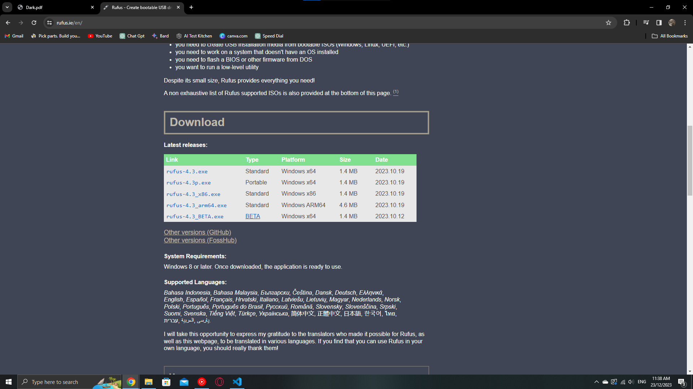
once that is downloaded, insert the flash drive and open rufus, it should
look like this 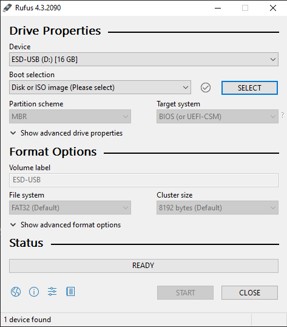
click on the select button and find the .iso file we downloaded before
your rufus should look like this 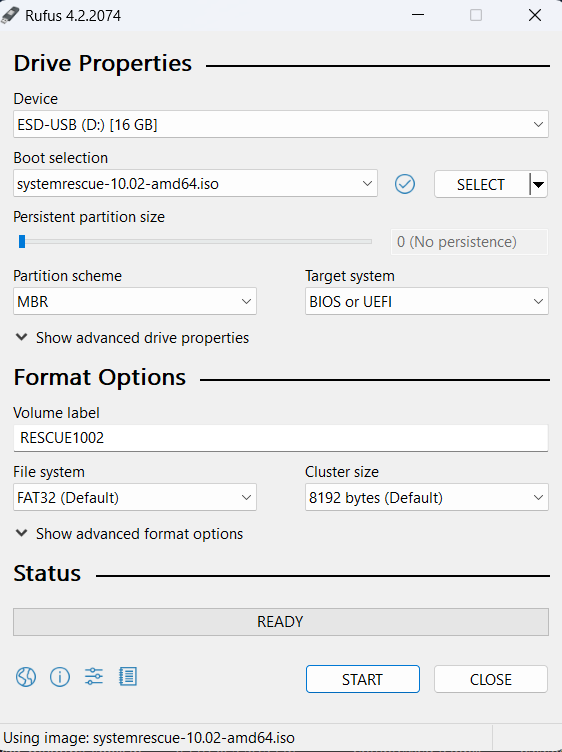

If you get a pop up that says write in iso mode or dd mode, choose
iso mode. once that has finished, continue onto bitlocker!

### If your own computer has Mac OS
To begin, we are going to need the usb and the other computer, launch
a web browser of your choice on the other computer and head to https://www.system-rescue.org/Download/
click on the blue text that says .iso at the end either Source Forge
or Fastly. When it has downloaded we need a tool to put the .iso file
on the usb. Head to [https://etcher.balena.io/](https://etcher.balena.io/),
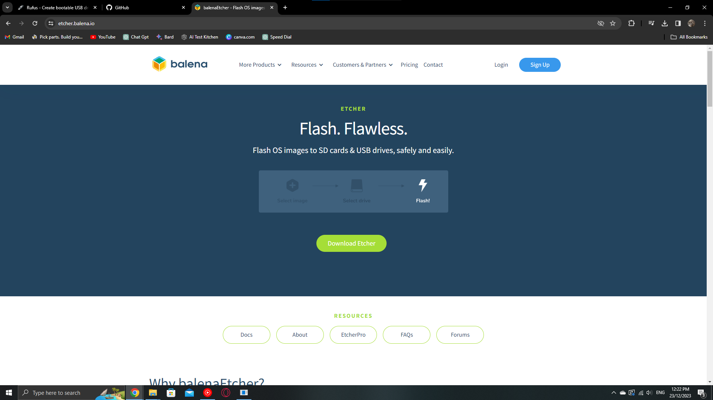 
and click download on Mac OS, go through the 
set up, insert the flash drive and open Balena, it should look like 
this 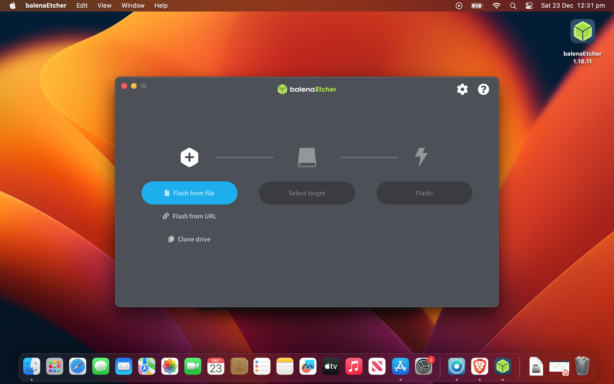
click on the flash from file 
button and find the .iso file we downloaded before, select target and 
flash! once that has finished, continue onto bitlocker!

### If your own computer has Linux
You can follow the steps for Mac OS, except download the linux variant
Im sorry but I could get any photos, I am a linux guy as well but my 
distro (Zorin OS) is broken.

## Bitlocker
To tell if you have bitlocker, go to file explorer and press This PC
if you have a lock on the C: Drive, you have bitlocker and need to follow
these steps. If you do not have bitlocker, skip this step
If bitlocker is enabled on your school computer, we are going to need
to get your bitlocker recovery key, this is vital to gain administrative
privileges. So to get your bitlocker password, go to [office.com](https://office.com)
and login with your school account and in the top right corner press
your profile picture 
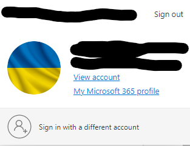 now
press view account. In there click on devices. You should see a list of devices
***IT IS VERY IMPORTANT THAT YOU SELECT THE CORRECT DEVICE HERE***
To find the correct device go into settings on the school laptop, go to
about your PC, there should be the name of the device. For example,
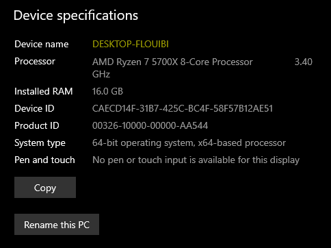
Go back to the list of devices and select the **Correct** device
now press view bitlocker keys and press show recovery key, 
**Write this down, you will not be able to proceed without it**.
If you see two operating system drives, write down both. Alright you can
proceed to the next section!

## Disabling Secure Boot
(If your device does not support secure boot you can skip this step)
To boot System Rescue, we are going to need to disable secure boot 
this step varies between devices, I have knowledge on Surface devices
I will be using a microsoft surface for the example. You can look up on
the internet how to disable Secure Boot on XXXX (Your device type).
To begin, we are going to hold shift on the restart button in the start
menu. You will be greeted by a menu at has a few option like Continue,
Use a device and troubleshoot. We want to go into troubleshoot, then
Advanced options, now press UEFI Firmware Settings. You should be greeted
by a screen that says UEFI in it.
Go into Security, press on secure boot, now press disabled. Go to exit 
and press restart now. Your computer will reboot and land on a screen 
like this
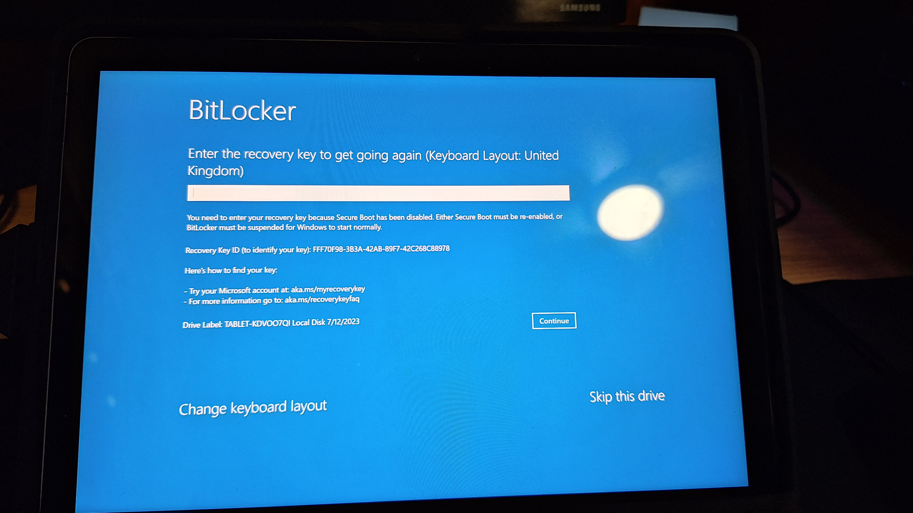
enter in the key you copied down before, it should be correct and it should
continue and you should end up back in Windows, login

## Booting System Rescue
hold shift and press restart, you should end up back in that menu from 
before, we want to press Use a device, you should see EFI USB Device, 
select that, your computer should reboot and end up on a screen like
this 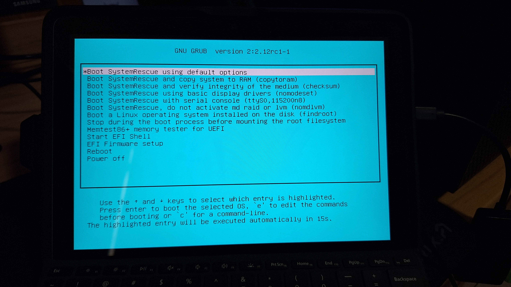 select the first option.
**DO NOT RESTART THE COMPUTER** you will see a bunch of "Hacker Code", don't
worry, that is normal. You should end up on a screen like this 
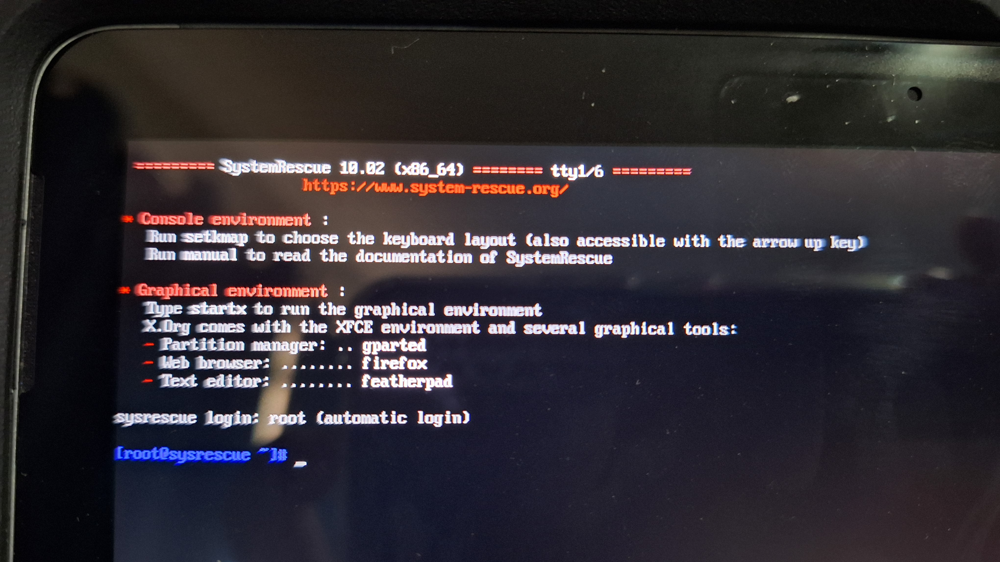
We now want to type 'startx' (Without the quotes). you should end up seeing
a blue mouse in the middle of the screen. You have successfully booted
System Rescue 
**Tip: open this article in system rescue with firefox, you will need to connect to the internet**

## Removing Bitlocker
If you did not have bitlocker, you may skip this step
Alright to start, 
Open up a terminal window (the little $_ icon)
We now want to start a tool called dislocker. First we need to enter some
commands. We need to start with these commands ```sudo mkdir -p /media/decrypt``` and
```sudo mkdir -p /media/windows-mount``` once you have entered those in we need to
get the partition info of the bitlocked drive. To do that, on the taskbar, you
should see a little hard drive, click on that. It should show something like this
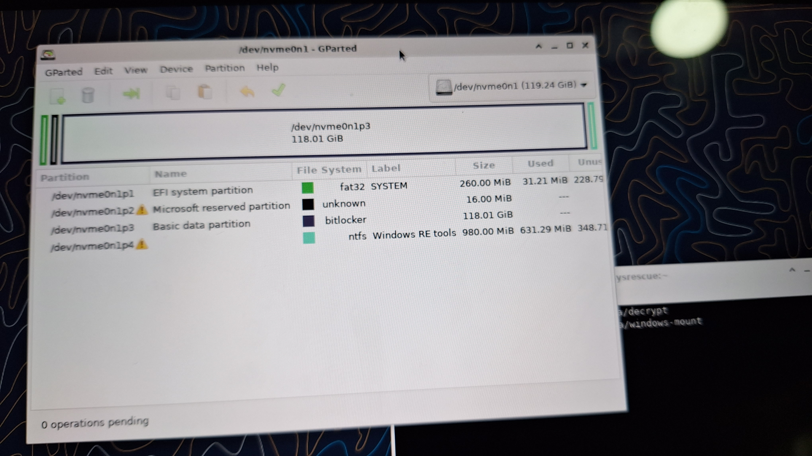
find where it says bitlocker and double click it, now where it says Path copy it
now go back to your terminal and enter this command 
```sudo dislocker <partition_name> -p<recovery_password> -- /media/decrypt```
Change the partition name to your path (copy and paste. Copy is ctrl+c and paste is ctrl+shift+v)
You also what to change the ```<recovery_password>``` to your bitlocker recovery key.
**There should be no space between your recovery key and the -p**
for example
 
(my colour will be different from yours)
click enter and if it works, there should be no errors. If there are, try again and
make sure the recovery key is correct.
We now want to run another command, this one will allow us to change files on our computer
```sudo mount -o loop /media/decrypt/dislocker-file /media/windows-mount```
Ff you have entered the command in correctly you should not get any errors
Congratulations you have successfully removed bitlocker! You move onto the next
section.

## Setting up the system to gain administrator rights
***THIS IS YOUR LAST CHANCE TO PULL OUT NOW. IF YOU CONTINUE NOW AND YOU BREAK SOMETHING, YOU WILL HAVE TO EXPLAIN IT TO YOUR I.T DEPARTMENT***
If you want to pull out, you can go to the X in the corner and press log out and restart. Do not forget to turn secure boot back on
If you want to continue, then lets keep going
press on the home folder on your desktop now press ```windows-mount``` on the side bar,
you should a bunch of folders like $RECYCLE.BIN You want to scroll down until you see a
folder called Windows, in there scroll down until you see a another folder named system32.
If you are in system32 you want to find a file called ```cmd.exe``` you want to **copy** that.
You want to open another file explorer (Don't close the current one, make sure you can 
still see cmd.exe) and go to system32 again and now find another file named ```sethc.exe``` 
you want to rename that to sethc2.exe, now go to the cmd.exe and rename that to sethc.exe,
now paste the cmd.exe you copied before. Now you should see cmd.exe appear. If have done this
correct, then you should now be ready for the next section!

## Gaining Admin rights
You are nearly done! If you have followed this far, it is safe to brag to your friends
that you are a master hacker. Lets begin the final steps! If you have completed last step
successfully, you should be on your lock screen, you now want to spam the shift button on
your keyboard, you should see a black box appear called sethc.exe. You have now bypassed 
school admin rights! now, in the black box you want to type ```compmgmt.msc``` a window
should show up that looks like this 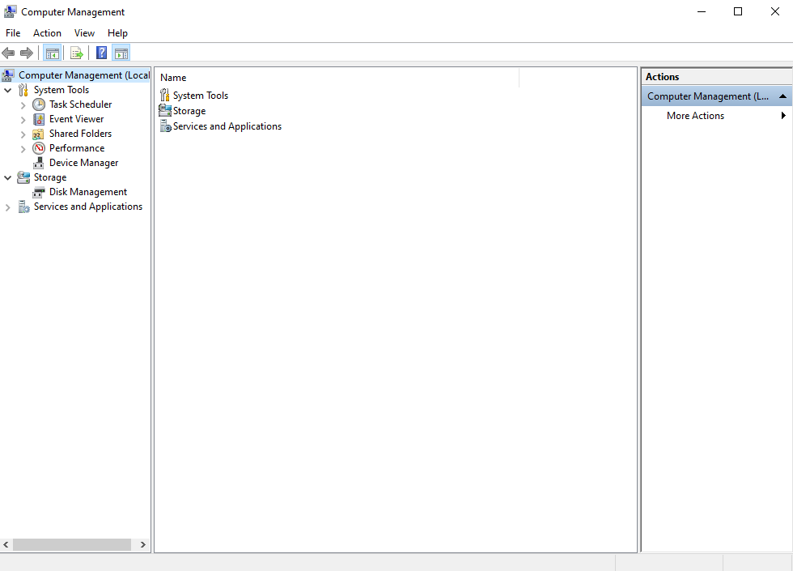
now go to local users and groups, then users,
**This part depends on your school setup**
now right click on administrators, click set password and set a password. Now press properties, 
there should be a check box that says account is disabled, if that is checked then uncheck 
it. If it is already unchecked then close the properties and right click and select change
password, change the password.
*If you get an error about password requirements while trying to enable the account, then close properties and right click and set password*,
depending on the password requirements, your password might have to be long. Once you have
finshed setting the password, close all of the windows opened and restart the computer.
Now on the lock screen, you should see an account called administrator, log into that.
If you don't see the account. go into other users and type for the username: 
administrator (**Must be spelled correctly**) and whatever password you set
**Now you are done!**

## What can you do now?
You can do whatever you like! You now control the computer. Somethings I recommend are to 
set your school account to administrator in settings and users. Use that account instead as
using administrator might cause suspision as you login in front of teachers and snitches.

## Congratulations!
You are now a hacker! You have bypassed the school I.T! Impressive achievement may I say!
Go brag to your friends, share them this article so they can do this as well, and maybe
the school will realise that installing school rubbish isn't a good idea.

## Thanks for reading my blog post
This took a long time to make, and you reading it justifies me making more hacking blog posts.
And with that, I bid you a farewell!